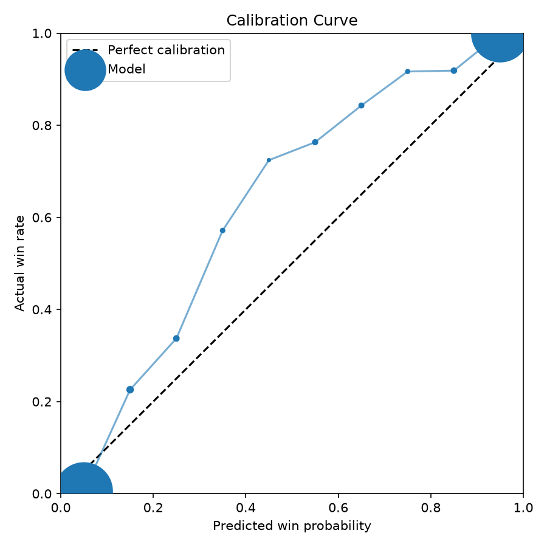
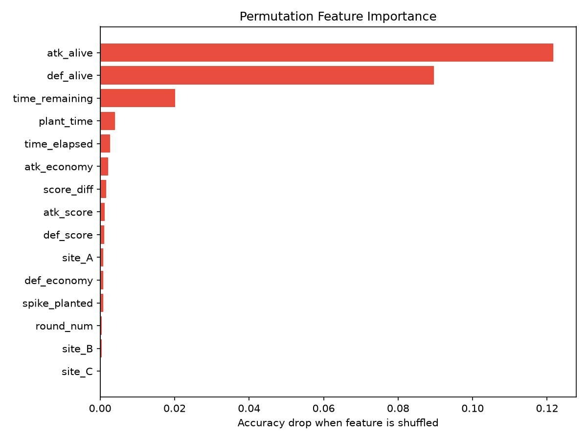
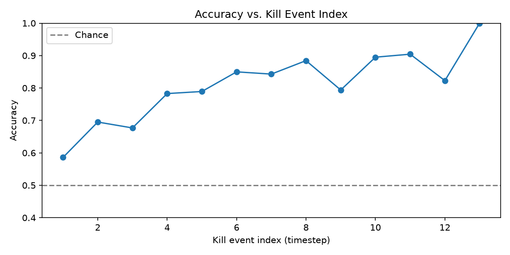
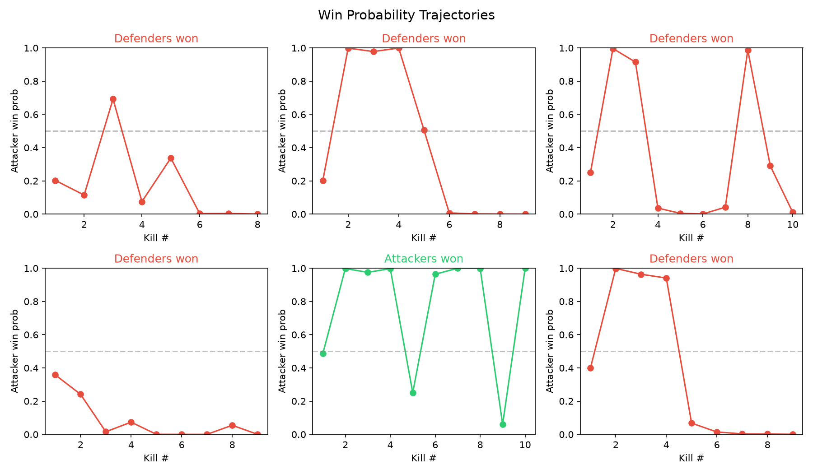

# Valorant In-Round Win Probability Predictor

**[Live Demo →](https://valorant-predictor-production.up.railway.app)**

A live win probability model for Valorant that updates dynamically after each kill — the same concept used in professional esports broadcast overlays. Given the current round state (players alive, spike planted, time remaining, economy), the model outputs the probability that the attacking team wins.

---

## Results

| Model | Accuracy | Notes |
|---|---|---|
| Logistic regression (round start only) | 71.3% | No in-round information |
| Logistic regression (mean-pooled sequence) | 89.6% | All snapshots, no temporal order |
| **2-layer LSTM (this project)** | **99.0%** | Full kill-by-kill sequence |

The 9.4% gap between the mean-pooled baseline and the LSTM directly demonstrates the value of temporal sequence modeling — the model doesn't just know *what* the state is, it knows *how it got there*.

### Calibration
When the model outputs 60% win probability, the attacking team wins ~64% of the time. A classifier that outputs arbitrary numbers is not useful — a calibrated probability is.

<p align="center">
  
  
</p>

<p align="center">
  
  
</p>

### Feature Importance
Permutation importance reveals that **player count dominates mid-round prediction**, while economy is surprisingly irrelevant once the round begins — economy determines what weapons players have, but by the time kills are happening, only who's alive matters.

---

## Architecture

```
Henrik Unofficial Valorant API
         │
         ▼
  Batch Fetcher           981 matches, snowball sampled
  (fetch_matches.py)      20,802 labeled rounds
         │
         ▼
  Parser                  Henrik JSON → RoundSnapshot sequences
  (parser.py)             One snapshot per kill event per round
         │
         ▼
  Feature Engineering     15-dim normalized vector per timestep
  (sequences.py)          Padded to (N=20802, T_max=13, F=15)
         │
         ▼
  2-layer LSTM            PackedSequence → hidden state → sigmoid
  (train.py)              BCELoss, Adam, best checkpoint saved
         │
         ▼
  FastAPI endpoint        POST /predict → win probability
  (serve.py)              Per-timestep probabilities included
```

---

## Data

Match data was collected from Henrik's Unofficial Valorant API using a **snowball sampling** strategy:

1. Started from a set of seed players (known accounts)
2. Downloaded their 20 most recent competitive matches
3. Extracted all 10 players from each match
4. Fetched those players' match histories in turn

This produced **981 unique competitive matches** across NA servers with no duplicates (deduplication by match ID). Each match was saved as raw JSON and parsed into **RoundSnapshot** sequences — one snapshot per kill event per round, capturing:

- Players alive on each team
- Whether the spike is planted and on which site
- Time elapsed / time remaining (switches to 45s defuse clock after plant)
- Team economy at round start
- Round number and current score

This yielded **20,802 labeled rounds** (~7 snapshots each) as the training dataset.

---

## Training Details

- **Split**: 85% train / 15% validation, split by **match** — all rounds from a given match go entirely into train or entirely into val. This prevents data leakage from shared player skill across rounds in the same match (834 train matches / 147 val matches).
- **Loss**: Binary Cross-Entropy (BCELoss) — standard for binary probability outputs
- **Optimizer**: Adam, learning rate 1e-3
- **Early stopping**: Best checkpoint saved by validation loss (peaked at epoch 23)
- **Architecture**: 2-layer LSTM, hidden dim 128, dropout 0.3, sigmoid output head
- **Sequences**: Padded to max length (T=13), PackedSequence used so the LSTM ignores padding

---

## Quick Start

**1. Install dependencies**
```bash
pip install -r requirements.txt
```

**2. Set up API keys**
```bash
cp .env.example .env
# Fill in RIOT_API_KEY (developer.riotgames.com)
# Fill in HENRIK_API_KEY (docs.henrikdev.xyz)
```

**3. Collect match data**
```bash
python3 -m src.ingestion.fetch_matches --seeds "PlayerName#TAG"
```

**4. Build features**
```bash
python3 scripts/build_features.py
```

**5. Train the model**
```bash
python3 scripts/train_model.py
```

**6. Evaluate**
```bash
python3 -c "
from src.training.evaluate import evaluate
evaluate('artifacts/models/best.pt', 'data/processed/dataset.npz')
"
```

**7. Serve**
```bash
python3 scripts/serve.py
```

---

## Docker

Train the model first (`scripts/train_model.py`), then run the API in a container:

```bash
docker compose up --build
```

The API will be available at `http://localhost:8000`.

> **Note:** The model checkpoint (`artifacts/models/best.pt`) is not tracked in git due to file size. You must train the model locally before building the Docker image.

---

## API

```bash
curl -X POST http://localhost:8000/predict \
  -H "Content-Type: application/json" \
  -d '{
    "snapshots": [
      {
        "attackers_alive": 5, "defenders_alive": 5,
        "spike_planted": 0, "time_elapsed_ms": 0,
        "time_remaining_ms": 100000, "plant_time_ms": 0,
        "attacker_economy": 15000, "defender_economy": 20000,
        "round_num": 5, "attacker_score": 3, "defender_score": 2,
        "plant_site": ""
      },
      {
        "attackers_alive": 4, "defenders_alive": 4,
        "spike_planted": 1, "time_elapsed_ms": 35000,
        "time_remaining_ms": 45000, "plant_time_ms": 35000,
        "attacker_economy": 15000, "defender_economy": 20000,
        "round_num": 5, "attacker_score": 3, "defender_score": 2,
        "plant_site": "B"
      }
    ]
  }'
```

```json
{
  "win_probability": 0.5506,
  "per_timestep": [0.5595, 0.5506]
}
```

---

## Project Structure

```
├── src/
│   ├── ingestion/
│   │   ├── henrik_client.py     Rate-limited Henrik API client
│   │   ├── fetch_matches.py     Batch match downloader (snowball sampling)
│   │   └── parser.py            Match JSON → RoundSnapshot sequences
│   ├── features/
│   │   └── sequences.py         Feature engineering, normalization, padding
│   └── training/
│       ├── config.py            Hyperparameter dataclass
│       ├── train.py             LSTM model + training loop
│       └── evaluate.py          Calibration, timestep accuracy, feature importance
├── scripts/
│   ├── build_features.py        CLI: build dataset.npz
│   ├── train_model.py           CLI: train LSTM
│   ├── baseline.py              Logistic regression baseline comparison
│   └── serve.py                 FastAPI prediction server
├── tests/                       23 pytest tests (parser, features, API)
└── assets/                      Evaluation plots
```

---

## Tech Stack

Python · PyTorch · FastAPI · scikit-learn · NumPy · httpx · Pydantic
